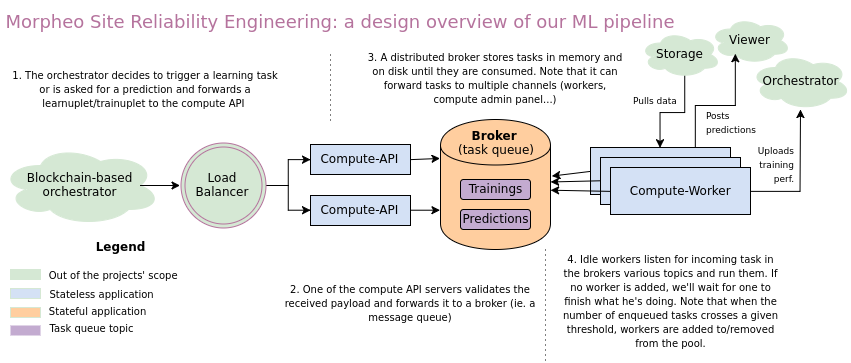

Morpheo-Compute: a container-based ML task queue
=================================================

Compute aims at providing a machine learning HTTP API and asynchronous task
queue that runs training and prediction jobs (possibly other jobs) in an
asynchronous way. It is part of the [Morpheo project](https://morpheoorg.github.io/morpheo/modules/introduction.html).

Design overview
---------------

Documentation
-------------

* [The compute API](./api)
* [The compute work-queue](./worker)
* [Docker-based workflow](https://morpheoorg.github.io/morpheo/modules/learning.html)

TODO
----
* API blueprint doc served by the API itself
* Same for the whole project's `godoc` and upload it on the official website

License
-------

All this code is open source and licensed under the CeCILL license - which is an
exact transcription of the GNU GPL license that also is compatible with french
intellectual property law. Please find the attached licence in English [here](./LICENSE) or
[in French](./LICENCE).

Note that this license explicitely forbids redistributing this code (or any
fork) under another licence.

Maintainers
-----------
* Étienne Lafarge <etienne_a t_rythm.co>
* Max-Pol Le Brun <maxpol_a t_morpheo.co>
